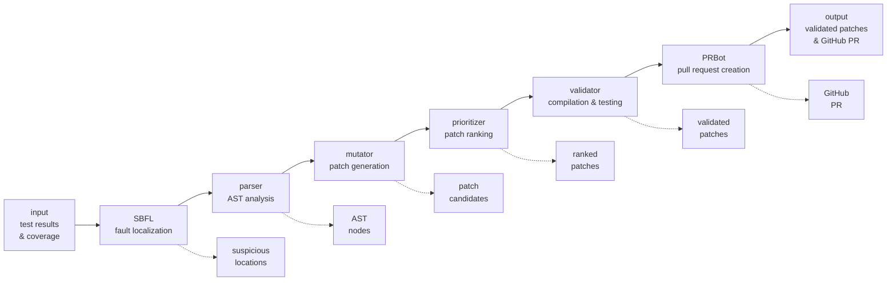

# CMPT 479 APR SYSTEM

**automated program repair pipeline** with end-to-end fault localization, patch generation, and validation.

> #### table of contents
>
> - [architecture](#architecture)
> - [building the project](#building-the-project)
> - [usage](#usage)
> - [running tests](#running-tests)
> - [output files](#output-files)
> - [project structure](#project-structure)
> - [pipeline workflow](#pipeline-workflow)

## architecture



***

## building the project

### 1. clone and navigate
```bash
git clone git@github.com:amenzies23/CMPT-479-Project.git
cd CMPT-479-Project
```

### 2. create out-of-source build directory
⚠️ **important:** this project enforces out-of-source builds to keep source tree clean.

```bash
# create and enter build directory
mkdir -p build
cd build

# configure with cmake (from build directory)
cmake ../CMPT-479-Project
```

### 3. build the project
```bash
make

# alternative: build with parallel jobs
make -j4

# alternative: use cmake build
cmake --build . -j4
```

### 4. build directory structure
after building, your `build/` directory will be organized as:
```
build/
├── bin/
│   ├── apr_system              # main executable
│   └── apr_tests               # test executable
├── lib/
│   └── libapr_system_lib.a     # static library
├── logs/                       # log files (auto-created)
├── results/                    # output results (auto-created)
└── CMakeFiles/                 # cmake build artifacts
```

***

## usage

### basic usage
```bash
# from build directory
./bin/apr_system --repo-url "https://github.com/user/repo"
# note: currently uses mock data for demonstration
```

### complete example
```bash
./bin/apr_system \
  --repo-url "https://github.com/user/repo" \
  --output-dir "./results" \
  --verbose
```

***

## running tests

### run all tests
```bash
# from build directory
./bin/apr_tests
```

### run specific test suites
```bash
# run with filters
./bin/apr_tests --gtest_filter="*SBFL*"
./bin/apr_tests --gtest_filter="*Validator*"
```

***

## output files

### pipeline results
```bash
# main results file (json format)
./results/pipeline_results.json
```

**example output structure:**
```json
{
  "pipeline_summary": {
    "suspicious_locations_count": 2,
    "patch_candidates_count": 2,
    "validation_results_count": 2,
    "pr_created": true
  },
  "repository_metadata": {
    "repository_url": "https://github.com/user/repo",
    "branch": "main",
    "commit_hash": "abc123"
  },
  "suspicious_locations": [...],
  "validation_results": [...],
  "pr_result": {
    "success": true,
    "pr_url": "https://github.com/user/repo/pull/123"
  }
}
```

### execution logs
```bash
# detailed logs with timestamps
./logs/apr_system.log
```

***

## project structure

```
CMPT-479-Project/
├── src/                    # source code
│   ├── main.cpp            # entry point
│   ├── cli/                # command line interface
│   ├── core/               # core utilities (logger, types)
│   ├── sbfl/               # spectrum-based fault localization (SBFL)
│   ├── parser/             # AST parsing and analysis
│   ├── mutator/            # patch generation
│   ├── prioritizer/        # patch ranking
│   ├── validator/          # patch validation
│   ├── prbot/              # [removed] PR creation handled by GitHub App
│   └── orchestrator/       # pipeline coordination
├── tests/                  
│   ├── unit/               # unit tests for each module
│   ├── integration/        # integration tests
│   └── fixtures/           # test data and fixtures
├── docs/                   # documentation
└── tools/                  # here will be github app impl
```

***

## pipeline workflow

### 1. **SBFL (spectrum-based fault localization)**
- analyzes test results and coverage data
- identifies suspicious code locations
- **output:** ranked list of potential fault locations

### 2. **parser**
- parses source files into abstract syntax tree (AST)
- extracts relevant code structures  
- **output:** AST nodes for suspicious locations

### 3. **mutator**
- generates patch candidates using mutation operators
- creates various fix alternatives
- **output:** set of potential patches

### 4. **prioritizer**
- ranks patches based on confidence metrics
- considers fault localization scores
- **output:** prioritized patch list

### 5. **validator**
- compiles and tests each patch
- validates functionality and correctness
- **output:** validation results with pass/fail status

### 6. **PR bot**
- creates pull requests for valid patches
- formats patch descriptions and metadata
- **output:** github pull request PR

***

## references

- [changelog](./CHANGELOG.md): version history, fixes, and feature additions
- [authors](./AUTHORS): project contributors and roles
